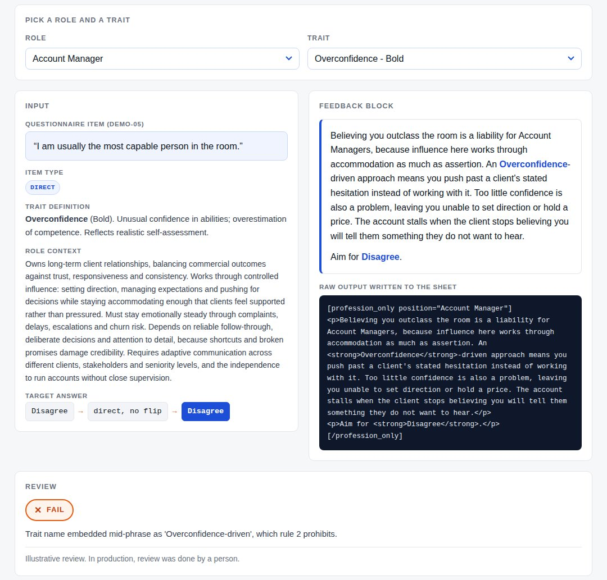
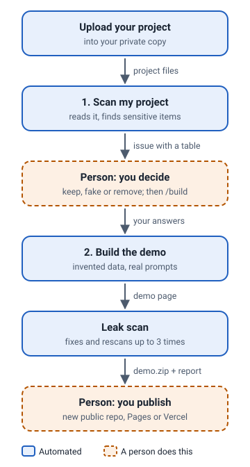

# portfolio-demo-kit

A Claude Code skill that turns a private project into a safe public portfolio demo, so you can show work that is under NDA.

**Live site with examples: https://jacing142.github.io/portfolio-demo-kit/**



*The [feedback generator demo](https://jacing142.github.io/portfolio-demo-kit/examples/feedback-engine/), made from a real client project. Every question, answer and output in it is invented.*

## What it does

1. It reads your project, lists everything sensitive in one table, and asks you what to keep, fake or leave out.
2. It builds a demo page, a diagram and a short case study from invented data, running your project's own logic where it can.
3. It checks the demo for leaks against your original files, fixes what it finds, and tells you exactly what it did.



## Try it

For technical users. You need [Claude Code](https://code.claude.com) and Python 3.11 or newer.

Install it from inside Claude Code:

```
/plugin marketplace add Jacing142/portfolio-demo-kit
/plugin install portfolio-demo@portfolio-demo-kit
```

Or copy the skill folder by hand:

```bash
git clone https://github.com/Jacing142/portfolio-demo-kit
cp -r portfolio-demo-kit/plugins/portfolio-demo/skills/portfolio-demo ~/.claude/skills/
```

Then open Claude Code in the cloned folder and ask:

```
Run the portfolio-demo skill on examples/apps-script-feedback/before
```

Claude plays it through with you: it explains the project, shows the table of findings, asks its questions, and writes the demo to a folder next to the project (never inside it). No API key is needed: without one, example outputs are written by Claude and labelled "Illustrative, written by Claude". If `ANTHROPIC_API_KEY` is set, the project's own prompts are run for real on the invented inputs and labelled with the model that answered.

The results of running it on both bundled examples are in [`examples/*/after/`](examples/) and on the [live site](https://jacing142.github.io/portfolio-demo-kit/).

## Safety

- **Use it only on work you are allowed to share**, and allowed to send to an AI provider. If you are not sure, ask your client first.
- **It reduces risk. It does not guarantee it.** Read every word of the demo before you publish it.
- It never writes into your project, never publishes anything, and never keeps keys or passwords, whatever you choose. See [DISCLAIMER.md](DISCLAIMER.md).

## FAQ

**What gets sent where?** Your project stays on your computer. Claude Code sends what Claude reads to Anthropic, as it does in any Claude Code session. If `ANTHROPIC_API_KEY` is set, the skill also sends your project's prompts, filled in with invented data, to the Anthropic API. Nothing is sent to the makers of this tool, and nothing is published until you publish it yourself.

**Which kinds of project work?** Anything made of text files: Python, JavaScript or TypeScript, Google Apps Script, SQL, prompt files, config files and spreadsheets saved as CSV. Excel files need saving as CSV first. Very large data files only need a sample.

**What does it cost?** The skill is free. You use your own Claude Code plan, plus your own API usage if you set a key. The cost depends on the size of your project: a small project is a short session.

**Where does the demo go?** By default to a new folder next to your project, called `<project>-portfolio-demo`. To publish it, create a new public repository with only that folder's files, then turn on GitHub Pages or import it into Vercel.

**How do I change settings?** Model, number of examples and scan thresholds are in [`config.toml`](plugins/portfolio-demo/skills/portfolio-demo/config.toml) inside the skill folder.

## Licence

MIT. See [LICENSE](LICENSE).
