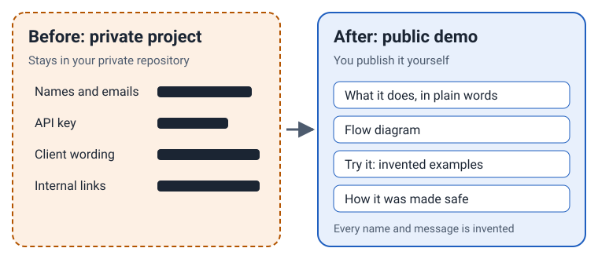
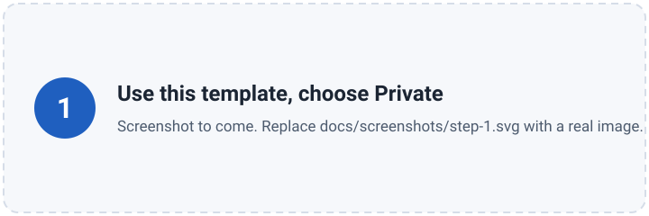
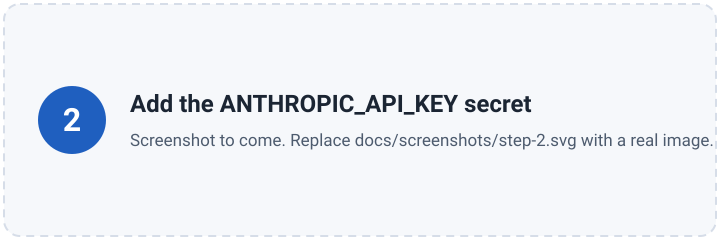
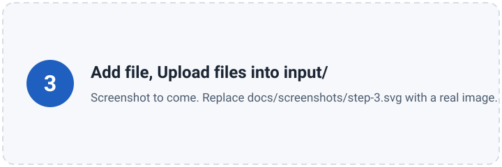
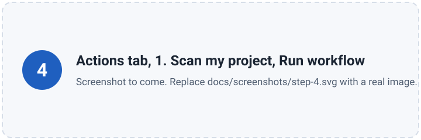
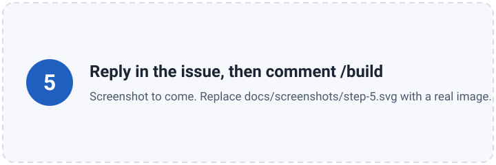
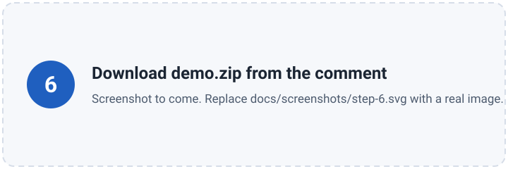

# portfolio-demo-kit

Turn private client work into a safe public demo you can show in your portfolio, without ever publishing the original.

## How it works

You upload your project to your own private copy of this repository. The tool reads it, lists
everything sensitive, and asks you what to keep, fake or remove. Then it builds a demo page from
invented data, runs your project's own prompts on that data, checks the result for leaks, and gives
you a zip file. You publish it yourself.

You get:

- a one-page website that explains the project and lets visitors try invented examples;
- a flow diagram;
- a case-study write-up;
- a report of what was found, what you decided, and how it was checked.

## Try it in 10 minutes

You do everything in your web browser. No software to install.

**1. Make your own private copy.** Click **Use this template > Create a new repository**, choose **Private**, and create it. Do not click Fork.

**2. Add your API key.** In your new repository: **Settings > Secrets and variables > Actions > New repository secret**. Name: `ANTHROPIC_API_KEY`. Value: your key from console.anthropic.com.

**3. Add your project.** Open the `input` folder, click **Add file > Upload files**, and drop in your files. Save spreadsheets as CSV first, and upload a sample (30-50 rows), not a full export. To try an invented example first, skip this step.

**4. Start the scan.** Open the **Actions** tab, click **1. Scan my project**, then **Run workflow**. After a few minutes a new issue appears in the **Issues** tab.

**5. Answer the questions.** The issue explains what your project does, lists everything it found with a suggestion for each (keep, fake or remove), and asks a few questions. Reply in plain words, for example: *"Keep the trait names, fake the role descriptions, QA was a manual review."* Then add a comment that says `/build`.

**6. Download your demo.** When the build finishes, the issue gets a comment with a link to **demo.zip** and the scan result. Unzip it, open `index.html`, and read it. To publish, follow [How do I publish the demo?](docs/FAQ.md#how-do-i-publish-the-demo).

## What it costs

The tool is free and open source. The AI work uses your own Anthropic API key, so you pay for your
own usage. The cost depends on the size of your project. Each stage posts its token use and an
estimated cost in the issue. Settings that affect cost (model, number of examples, fix attempts)
are all in [`config.toml`](config.toml).

## Safety

> [!WARNING]
> - **Use it only on work you are allowed to share**, and allowed to send to an AI provider. If you are not sure, ask your client.
> - **The tool reduces risk. It does not guarantee it.** Read every word of the demo before you publish it.
> - **Never fork this repository.** Forks of public repositories are public. Always use "Use this template" and choose Private.
>
> More in [DISCLAIMER.md](DISCLAIMER.md).

What the tool does to keep you safe:

- It works only in a private repository and stops if the repository is public.
- It invents new data from the shape of yours; it never edits your real rows.
- It plants ten fake "canary" strings in a working copy. If any reaches the demo, the demo is blocked.
- A leak scanner compares every file in the demo with your project: exact text, runs of six or more words, keys, emails, private links and IDs. It tests itself on every run.
- It never publishes anything. You do that yourself, after reading it.

## Questions

**What is sent where?** Your files stay in your private repository. While the workflows run, they are sent to Anthropic's API with your own key. Nothing is sent to the makers of this tool. [Full answer](docs/FAQ.md#what-is-sent-where).

**Which kinds of project work?** Anything made of text files: Python, JavaScript, Google Apps Script, SQL, prompt files, and spreadsheets saved as CSV. [Full answer](docs/FAQ.md#which-kinds-of-project-work).

**How do I change the model?** Edit `config.toml` in the browser (pencil icon) and change `agent` or `demo_outputs`. [Full answer](docs/FAQ.md#how-do-i-change-the-model).

[All questions and answers](docs/FAQ.md)

## For the technically curious

- The method: [`.claude/skills/portfolio-demo/SKILL.md`](.claude/skills/portfolio-demo/SKILL.md). It works the same in Claude Code on your own computer.
- The leak scanner: [`scanner/`](scanner/README.md), Python standard library only, with tests.
- The workflows: [`.github/workflows/`](.github/workflows/).
- Templates for the page, diagram, case study and report: [`templates/`](templates/).
- What still needs testing with a real API key: [`TESTING.md`](TESTING.md).

MIT licensed. See [LICENSE](LICENSE).
