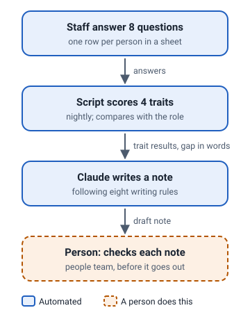

# Workstyle feedback writer

A Google Apps Script that turns a short workstyle questionnaire into a warm, personal feedback note for each member of staff.

**[Open the live demo](index.html)**. Everything in it is invented. The scoring and prompt-building code is the project's own, run on invented answers.

## The problem

Staff filled in a questionnaire about how they work, but the results were just numbers. Turning them into feedback someone could act on took a person several minutes per member of staff, and the tone varied from note to note.

## What I built

- A Google Apps Script, bound to a Google Sheet, that runs every night.
- Scoring that averages two questions per trait and compares each trait with what the person's role needs, then describes the gap in words rather than numbers.
- A prompt with eight writing rules, so every note starts with a strength, mentions at most two gaps as habits to try, and ends with something concrete to do.
- A human check: a member of the people team checks each note before it goes out.

## How it works

1. Staff answer eight questions; each answer is a row in the sheet.
2. Each night the script scores four traits (Anchor, Kindle, Lattice, Horizon) and compares them with the role.
3. It sends the results, the role description and the person's comment to Claude, which writes a short note.
4. A person checks each note before it goes out. People in a role the sheet does not know are skipped and handled by hand.

## What the demo shows

Pick an example to see the invented answers, the prompt the project's own code assembled from them, and the note. The examples cover a mixed profile, someone on target everywhere, someone with two big gaps and no comment, a very long comment, and a role the script does not recognise.

- "Generated by ... using this project's prompt on invented inputs" means the output is a real run.
- "Illustrative, written by Claude" means the output is a written example that follows the project's rules, not a real run. Every note in this demo is illustrative, because it was built without an API key.

## Built with

Google Apps Script, Google Sheets, the Anthropic API.

## About this demo

This is a safe public copy of private work. Names, answers, roles and targets are invented and the source code is not included. [SANITISATION.md](SANITISATION.md) lists what was removed, what was changed and how the demo was checked for leaks.
