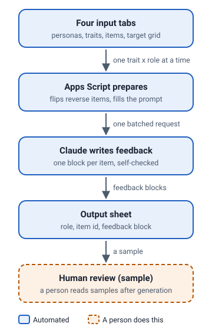

# Psychometric Feedback Generator — public demo

**Problem.** A personality assessment returns a trait profile, but a score alone tells a candidate nothing. Someone had to explain, for every questionnaire item and every job role, why the target answer is the right one for *that* role. At 165 items across 41 roles that is 6,765 pieces of writing, which nobody was going to hand-author.

**What the pipeline does.** A Google Apps Script bound to one Sheet reads four tabs: role personas, trait definitions, the questionnaire items (each flagged direct or reverse), and a trait × role grid of target answers. It loops trait × role, inverts the target for reverse-worded items, batches all items for that pair into a single Anthropic API call, and appends the returned `[profession_only]` blocks to an output tab. It checkpoints its position in `ScriptProperties`, so a run that hits the Apps Script execution limit resumes exactly where it stopped.

**Quality control.** The generation prompt carries twelve numbered writing rules and a self-review standard: bold the trait on first use, one concrete role-specific consequence, no em dashes, no instrument jargon, no scoring language, strict template. Extreme targets get a single direction; middle targets have to argue why *both* extremes hurt. After each run, a person reviewed a sample of the generated blocks by hand. There was no automated pass/fail step.

**How the demo was made safe.** Every questionnaire item here was written from scratch. Every target answer was invented and deliberately set to a different value from the real key for that same trait and role. Every feedback block and review verdict was written for this demo. Role personas were paraphrased. No API key, sheet ID, script ID, or client data is present. Trait names and trait definitions are retained, which was the client's decision.

**Verification.** Before publishing, a leak scan compared every file in this folder with the private source files: questionnaire statements, question codes, role descriptions, target-grid cells and anything that looks like a key or ID. It found nothing. The scan was itself tested with planted leaks, so a clean result means the checks ran and found nothing. The plain-words summary is in [SCAN_REPORT.md](SCAN_REPORT.md).

---

## Flow



## Running it

```
python3 -m http.server -d docs/examples/feedback-engine 8000
```

Then open <http://localhost:8000>. `index.html` carries its own copy of the data inline, so opening the file directly from disk works too. `data.json` is the same payload as a standalone file; both are written by the same build step and cannot drift.

## What is in here

| File | |
|---|---|
| `index.html` | The whole demo. One page, no framework, no build step, no external requests. |
| `data.json` | 8 invented items across 8 real traits, 3 roles, an invented target grid, 24 feedback blocks with illustrative review verdicts. The same data is inline in `index.html`. |
| `diagram.svg` | The pipeline diagram. |
| `SCAN_REPORT.md` | What the leak scan checked, in plain words, and the result. |

The demo makes no API calls. The feedback blocks were written by Claude for this demo, following the production pipeline's writing rules, and are served as static data.

## Scale

|  | Production | This demo |
|---|---|---|
| Questionnaire items | 165 | 8 (invented) |
| Roles | 41 | 3 |
| Traits | 33 subscales across 11 scales | 8 subscales |
| Feedback blocks | 6,765 | 24 |

## About the review badges

In production, quality control lived in two places: the self-review standard inside the generation prompt, and a person reviewing samples of the output by hand. There was no separate review call and no pass/fail column in the real output sheet. The Pass and Fail badges in this demo are an illustrative review, written for this demo, that apply the same writing rules visibly. Four of the twenty-four blocks were written to fail, each for a different rule.
