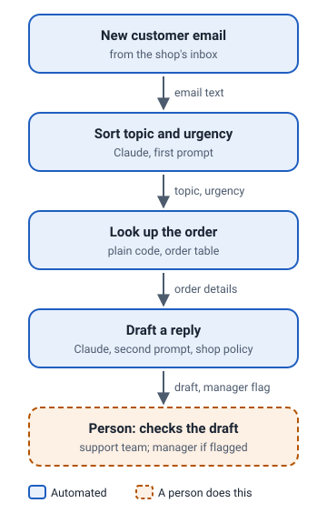

# Support email triage

A Python script that sorts each customer email by topic and urgency, looks up the order, and drafts a reply for a person to check.

**[Open the live demo](index.html)**. Everything in it is invented. The order lookup, the escalation rule and the prompt assembly are the project's own code, run on invented emails.

## The problem

A small online homeware shop answers every customer email by hand. Most are routine (where is my parcel, can I return this), but a few are urgent, and a safety problem buried in a polite email is easy to miss when the inbox is busy.

## What I built

- A Python script, standard library only, that reads new emails and the shop's order table.
- A sorting prompt that puts each email into one of five topics with an urgency from 1 to 3, with a rule that any hint of a safety problem is always most urgent.
- An order lookup that finds the order number in the email and adds the order's status to the reply prompt.
- A reply prompt that drafts an answer in the shop's tone, following its refund, delivery and safety policy.
- An escalation rule that flags urgent emails and high-value orders for a manager.

## How it works

1. A new customer email arrives.
2. Claude sorts it by topic and urgency.
3. The script finds the order number and looks up the order.
4. Claude drafts a reply that follows the shop's policy. Urgent emails and high-value orders are flagged for a manager.
5. A person on the support team reviews each draft before it goes out.

## What the demo shows

Pick an example to see the invented email, what the order lookup found, the sorting prompt the project's code assembled, and the result. The examples cover a safety problem, a late parcel, a refund on a high-value order, a question with no order number, an angry repeat email, and an email in French.

- "Generated by ... using this project's prompt on invented inputs" means the output is a real run.
- "Illustrative, written by Claude" means the output is a written example that follows the project's rules, not a real run. Every result in this demo is illustrative, because it was built without an API key.

## Built with

Python (standard library only), the Anthropic API, a CSV order table.

## About this demo

This is a safe public copy of private work. Customers, orders and staff are invented, the shop's policy wording is not included, and neither is the source code. [SANITISATION.md](SANITISATION.md) lists what was removed, what was changed and how the demo was checked for leaks.
